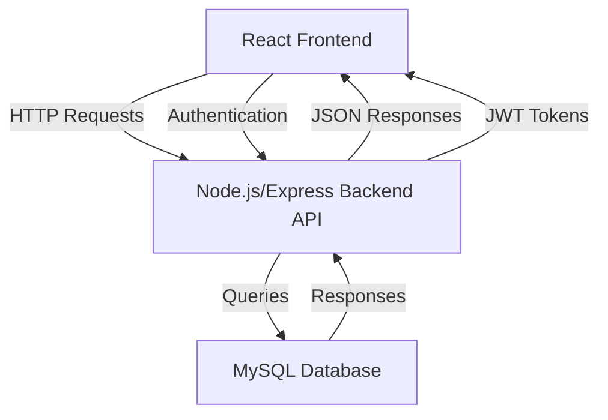

# Vibely

A comprehensive web application for managing events, allowing organizers to create and manage events, users to browse and book tickets, and administrators to oversee the platform. The system includes features like event approval, ticket booking with QR code verification, and payment tracking.

## Features

- **User Authentication**: Registration, login, and role-based access (Admin, Organizer, User)
- **Event Management**: Organizers can create, edit, and manage events with categories and images
- **Admin Approval**: Events require admin approval before going live
- **Ticket Booking**: Users can browse events, select ticket types, and book tickets
- **Payment Integration**: Track payments for bookings
- **QR Code Verification**: Generate and verify QR codes for ticket check-ins
- **Dashboard Views**: Separate dashboards for admins, organizers, and users
- **Responsive Design**: Built with React and Tailwind CSS for mobile-friendly UI

## Tech Stack

- **Frontend**: React 19, Vite, React Router, Tailwind CSS, Axios, Recharts, jsPDF, QRCode.react
- **Backend**: Node.js, Express.js, JWT, bcryptjs, CORS
- **Database**: MySQL
- **Other**: Lucide React for icons

## Prerequisites

- Node.js (v16 or higher)
- MySQL (v8 or higher)
- npm or yarn

## Installation

1. **Clone the repository**:
   ```bash
   git clone <repository-url>
   cd event-management-system
   ```

2. **Setup Backend**:
   ```bash
   cd server
   npm install
   ```
   - Create a MySQL database and run the schema from `schema.sql`
   - Configure environment variables in `server/.env` (e.g., DB credentials, JWT secret)

3. **Setup Frontend**:
   ```bash
   cd ../client
   npm install
   ```
   - Configure API base URL in `client/.env` if needed

4. **Start the Application**:
   - Backend: `cd server && npm start`
   - Frontend: `cd client && npm run dev`

## Usage

- Access the frontend at `http://localhost:5173` (default Vite port)
- Backend API runs on `http://localhost:3000` (configurable)
- Register as a user, organizer, or admin to explore different functionalities

## High-Level System Architecture

**Figure 1: High-Level System Architecture of Vibely**



This diagram illustrates the high-level architecture of Vibely, where the React frontend communicates with the Node.js/Express backend API via HTTP requests, and the backend interacts with the MySQL database for data persistence. Authentication is handled via JWT tokens.

## Backend API Flow and Actions

The backend is built with Node.js and Express.js, providing a RESTful API for the event management system. It handles authentication, event management, ticket booking, and administrative functions. Below is a detailed explanation of the backend flow and key actions.

### Authentication Flow

1. **User Registration** (`POST /api/auth/register`):
   - Accepts `fullName`, `email`, `password`, and optional `role` (defaults to 'user').
   - Validates if email is unique.
   - Hashes password using bcryptjs.
   - Inserts user into `users` table with role (admin, organizer, or user).

2. **User Login** (`POST /api/auth/login`):
   - Accepts `email` and `password`.
   - Verifies credentials against the database.
   - Generates JWT token with user ID and role.
   - Returns token and user details.

3. **Profile Update** (`PUT /api/auth/profile`):
   - Requires authentication (JWT token).
   - Allows updating `fullName`, `email`, and password (with current password verification).

### Middleware

- **authMiddleware**: Verifies JWT token from `Authorization` header. Decodes and attaches user info to `req.user`.
- **roleMiddleware**: Checks if user's role is in allowed roles for protected routes.

### Event Management Flow

1. **Create Event** (`POST /api/events`) - Organizer only:
   - Requires authentication and 'organizer' role.
   - Accepts event details: `title`, `description`, `event_date`, `start_time`, `location`, `category`, `banner_image`, and `tickets` array.
   - Validates required fields and ticket data.
   - Inserts event into `events` table with status 'pending'.
   - Inserts associated tickets into `tickets` table.

2. **Get Public Events** (`GET /api/events/public`):
   - Fetches approved events with optional search and category filters.
   - Joins `events` and `users` tables for organizer name.
   - Includes ticket information for each event.

3. **Get Event Details** (`GET /api/events/public/:eventId`):
   - Fetches specific approved event with tickets.

4. **Organizer's Events** (`GET /api/events/my-events`) - Organizer only:
   - Fetches all events created by the authenticated organizer, including pending/approved status.

5. **Update Event** (`PUT /api/events/:eventId`) - Organizer only:
   - Allows organizers to edit their events (title, description, date, etc.).
   - Verifies ownership before updating.

6. **Delete Event** (`DELETE /api/events/:eventId`) - Organizer only:
   - Deletes event and associated tickets (cascading delete).

### Admin Actions

1. **Get Pending Events** (`GET /api/events/pending`) - Admin only:
   - Fetches events with status 'pending' for approval.

2. **Approve Event** (`POST /api/events/:eventId/approve`) - Admin only:
   - Changes event status from 'pending' to 'approved'.

3. **Reject Event** (`POST /api/events/:eventId/reject`) - Admin only:
   - Changes event status to 'rejected'.

4. **Get All Events** (`GET /api/events/all`) - Admin only:
   - Fetches all events regardless of status.

5. **Get Users** (`GET /api/events/users`) - Admin only:
   - Lists all users with their details.

6. **Admin Stats** (`GET /api/events/admin-stats`) - Admin only:
   - Provides dashboard statistics: total users, published events, revenue, growth metrics.

### Ticket Booking Flow

1. **Create Booking** (`POST /api/events/booking/create`):
   - Requires authentication.
   - Accepts `eventId`, `ticketSelections` (object with ticket IDs and quantities), `totalAmount`, `paymentMethod`.
   - For each selected ticket:
     - Checks availability.
     - Calculates total price.
     - Inserts booking into `bookings` table with status 'confirmed'.
     - Updates ticket quantities (sold and available).
     - Inserts payment record into `payments` table.
     - Generates unique QR code for the booking.

2. **Get User Bookings** (`GET /api/events/my-bookings`):
   - Fetches user's confirmed and pending bookings with event details.

3. **Verify Ticket** (`GET /api/events/verify-ticket/:bookingId`):
   - Public endpoint for ticket verification.
   - Returns booking details including QR code, event info, and organizer name.
   - Used for check-in at events.

### Database Interactions

The backend uses MySQL with the following key tables:

- **users**: Stores user accounts with roles.
- **events**: Event details, linked to organizers, with approval status.
- **tickets**: Ticket types per event, tracking price, availability, and sales.
- **bookings**: User bookings for specific tickets, with QR codes.
- **payments**: Payment records linked to bookings.
- **checkins**: For future ticket validation at events.

All database operations use parameterized queries to prevent SQL injection. The connection is established via a promise-based pool for efficient handling.

### Error Handling

- Global error handler in `server.js` catches unhandled errors.
- Controllers return appropriate HTTP status codes and JSON error messages.
- Authentication errors (401/403) for unauthorized access.
- Validation errors (400) for bad requests.
- Server errors (500) for internal issues.

This backend architecture ensures secure, role-based access to event management functionalities, supporting the full lifecycle from event creation to ticket verification.

## Database Schema

The system uses MySQL with the following key tables:
- `users`: User accounts with roles (admin, organizer, user)
- `events`: Event details, linked to organizers
- `tickets`: Ticket types per event with pricing and availability
- `bookings`: User bookings for specific tickets
- `payments`: Payment records for bookings
- `checkins`: QR code verification records

See `server/schema.sql` for the complete schema.

## API Endpoints

- **Auth**: `/api/auth/register`, `/api/auth/login`
- **Events**: `/api/events` (CRUD operations)
- **Bookings**: `/api/bookings`
- **Admin**: `/api/admin/approve-events`

## Contributing

1. Fork the repository
2. Create a feature branch
3. Commit your changes
4. Push to the branch
5. Open a Pull Request

## License

This project is licensed under the ISC License.